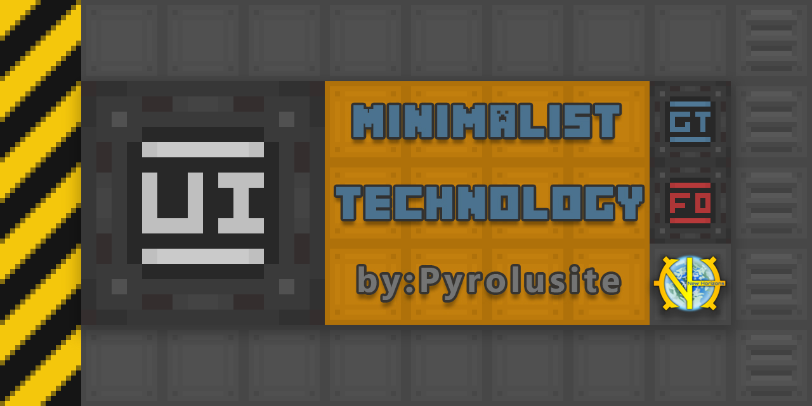

| [English](README.md) | [简体中文](README_zh.md) |

# Minimalistic-GTNH-gameUI*

It belongs to a resource pack other than the repair project.

`Fogy` found that the original author is involved in this aspect of UI, so I plan to reproduce this project.

| branch: [repair](https://github.com/Fogy-F/Minimalistic-GTNH-repair) & [extend](https://github.com/Fogy-F/Minimalistic-GTNH-repair/tree/extend)
| change: [log screenshot](https://github.com/Fogy-F/Minimalistic-GTNH-repair/discussions/1?sort=new)
| demand: [feedback](https://github.com/Fogy-F/Minimalistic-GTNH-repair/discussions/2) |

---

### :blue_book: main content

<b>game screenshots</b>: unfold

project under construction...

<b>resource project</b>: unfold

project under construction...

---

### :green_book: statement

All updates, fixes, and redesigns to the original textures are original derivative works, created without replicating elements from other resource packs.

The original creator of this resource pack, `Pyrolusite`, has discontinued updates. The project is now maintained by `Fogy`, who will handle future updates and fixes.

Should the original creator resume development, please contact me to request the removal of this page. Contact: `2480564500@qq.com`.

Software used: `Aseprite` & `Photoshop` & `Visual Studio Code` & `XYplorer`.

---

### :orange_book: URL

project: [GregTech: New Horizons](https://github.com/GTNewHorizons)

platform: [GTNH HuiJi Wiki](https://gtnh.huijiwiki.com/wiki/%E8%B5%84%E6%BA%90%E5%8C%85)

original: [IC2 Forum Post (original MT)](https://forum.industrial-craft.net/thread/10612-16x-minimalist-technology-gt6-gt5e/)

original: [Archived Forum Thread (GTNH MT)](https://web.archive.org/web/20230422125419/https://www.gtnewhorizons.com/forum/m/36844562/viewthread/32165079-minimalist-gt-v-010)

successor: [github:Minimalistic-GTNH-repair](https://github.com/Fogy-F/Minimalistic-GTNH-repair)

backups: [gitee:Minimalistic-GTNH-repair](https://gitee.com/fogy-f/minimalistic-gtnh-repair)
