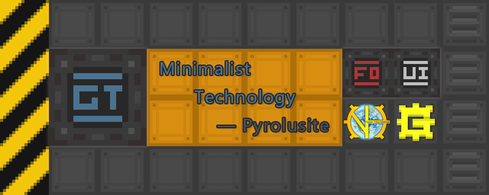
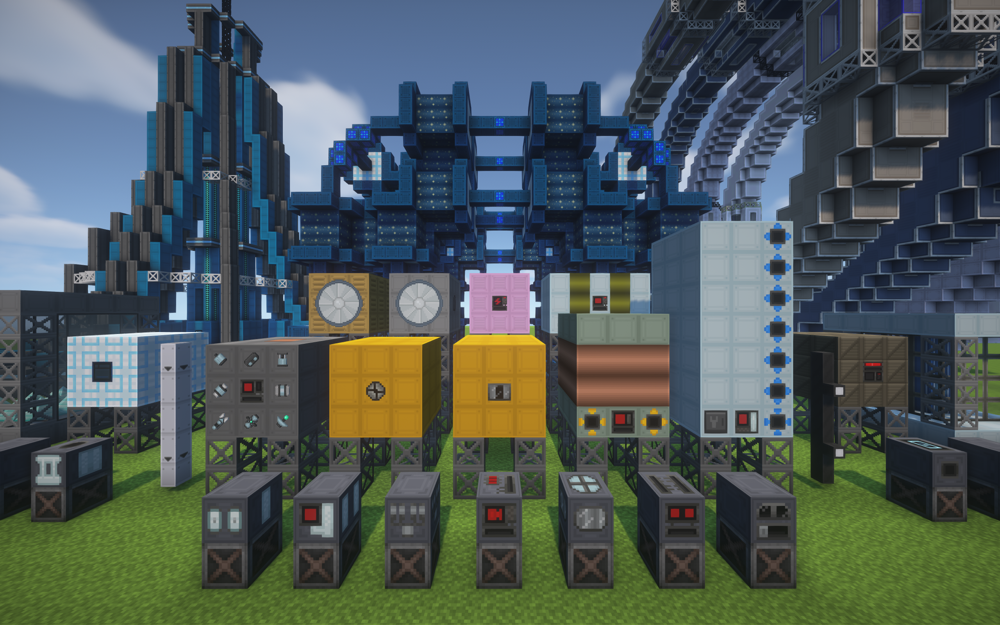

| [English](README.md) | [简体中文](README_zh.md) |

# Minimalistic-GTNH-repair

Want to keep your machine looking cleaner and more organized? Try this 16x resource pack.

| branch: [extend](https://github.com/Fogy-F/Minimalistic-GTNH-repair/tree/extend) & [gameUI](https://github.com/Fogy-F/Minimalistic-GTNH-repair/tree/gameUI)
| change: [log screenshot](https://github.com/Fogy-F/Minimalistic-GTNH-repair/discussions/1)
| demand: [feedback](https://github.com/Fogy-F/Minimalistic-GTNH-repair/discussions/2) |

---

### :blue_book: main content

> Partial machine display:

<b>game screenshots</b>: unfold

> (The image may not display, please download it in git).

<b>resource project</b>: unfold

> __-Additional mod textures-__
>
> - [`Twist Space Technolgy Mod`](https://github.com/Nxer/Twist-Space-Technology-Mod)
> - [`BetterTooltipBox`](https://github.com/xiaoxing2005/BetterTooltipBox)

> __`Gregtech`__
>
> - `GT++`
> - `KekzTech`
> - `KubaTech`
> - `BartWorks`
> - `BC Silicon`
> - `GigaGramFab`
> - `StructureLib`
> - `Good Generator`
> - `GT:New Horizons`
> - `GTNH: Lanthanides`
> - `GTNH-Intergalactic`
> - `TecTech-Tec Technology!`
> - Update only the GT part: `GalaxySpace`

> __`IndustrialCraft2`__
>
> - `AFSU Mod`
> - `Super Solar Panel`
> - `Advanced Solar Panel`
> - `Compact Kinetic Wind and Water Generators`

> __`Ender IO`__

<b>recommend</b>: unfold

> UI: [`Modernity-GTNH-UI`](https://github.com/ABKQPO/Modernity-GTNH-UI)
>
> High version MC resource: [`Modernity`](https://www.curseforge.com/minecraft/texture-packs/modernity) & [`New Default+`](https://www.curseforge.com/minecraft/texture-packs/newdefaultplus)
>
>Mod Support resource(Covered part): [`Unity`](https://www.curseforge.com/minecraft/texture-packs/unity)

<b>Other</b>: unfold

> (Long-winded).

This resource pack isn't fully updated, as `Fogy` believes some textures simply don't need redesigning (lazy).

However, we prioritize overall consistency by focusing on fixing inaccuracies, polishing critical details, and maintaining compatibility with ongoing updates.

Feel free to share ideas or suggestions in the [`discussions`](https://github.com/Fogy-F/Minimalistic-GTNH-repair/discussions) section.

---

### :green_book: statement

All updates, fixes, and redesigns to the original textures are original derivative works, created without replicating elements from other resource packs.

The original creator of this resource pack, `Pyrolusite`, has discontinued updates. The project is now maintained by `Fogy`, who will handle future updates and fixes.

Should the original creator resume development, please contact me to request the removal of this page. Contact: `2480564500@qq.com`.

Software used: `Aseprite` & `Photoshop` & `Visual Studio Code` & `XYplorer`.

---

### :orange_book: URL

project: [GregTech: New Horizons](https://github.com/GTNewHorizons)

platform: [GTNH HuiJi Wiki](https://gtnh.huijiwiki.com/wiki/%E8%B5%84%E6%BA%90%E5%8C%85)

original: [IC2 Forum Post (original MT)](https://forum.industrial-craft.net/thread/10612-16x-minimalist-technology-gt6-gt5e/)

original: [Archived Forum Thread (GTNH MT)](https://web.archive.org/web/20230422125419/https://www.gtnewhorizons.com/forum/m/36844562/viewthread/32165079-minimalist-gt-v-010)

successor: [github:Minimalistic-GTNH-repair](https://github.com/Fogy-F/Minimalistic-GTNH-repair)

backups: [gitee:Minimalistic-GTNH-repair](https://gitee.com/fogy-f/minimalistic-gtnh-repair)
